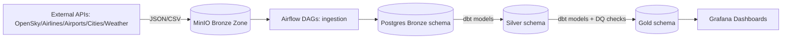

# 🛫 WingWatch — Real-Time Flight Data Pipeline

-blue>)


**In the skies, every beep and blip is data.**
⚡ **WingWatch** takes raw aviation chaos straight from **OpenSky**, **airlines DB**, **OurAirports**, **cities**, and **OpenWeather**, then wrangles it into **analytics-ready dashboards**.

It’s basically **turning the sky into a spreadsheet** (but way cooler). 🚀

***

## ✨ Why WingWatch?

Ever wondered:
- Which flights are approaching an airport right now? 🛬
- How many aircraft are broadcasting an **emergency squawk** (7500/7600/7700)? 🚨
- What percentage of flights are **climbing vs. cruising vs. landing**? 📊
- Which airlines still fly **rare/supersonic machines**? ✈️

👉 WingWatch answers all this in REAL-TIME. The project is designed as a **production-grade data playground** that demonstrates:
- **Airflow DAG orchestration** (from raw → bronze → silver → gold)
- **dbt transformations** with schema tests + DQ checks built-in
- **Medallion Lakehouse architecture** on **Postgres** 🏗️
- **MinIO** for storing API dumps and raw JSON/CSVs 🌩️
- **Grafana** dashboards (hooked into Gold) 📊

It’s the **Avengers for flight data pipelines**.

***

## 🛠 Tech Stack

| Component         | Technology                         | Role |
|-------------------|------------------------------------|------|
| **Orchestration** | Apache Airflow 2.10.0              | Task scheduling, pipeline runs |
| **Storage (Raw)** | MinIO (S3-compatible object store) | Store API dumps & CSVs |
| **Warehouse**     | PostgreSQL 13                      | Bronze, Silver & Gold schemas |
| **Transformations** | dbt-core + dbt-postgres          | SQL-based transformations |
| **Data Quality**  | dbt tests + custom Python checks   | Null, duplicate, range, unique |
| **Realtime APIs** | OpenSky, OpenWeather, Airports DB  | Flight data, airlines, airports, cities |
| **Viz**           | Grafana                            | Dashboards on Gold schema |
| **Deployment**    | Docker Compose                     | Spin it all up 🚀 |

***

## 🗺️ Data Flow (Medallion Style)



- **Raw → Bronze**: Data ingested from APIs, stored in MinIO, loaded to Postgres.
- **Silver**: dbt cleans, standardizes, adds metadata.
- **Gold**: Aggregated, business-ready insights (flight phases, emergencies, peak traffic).
- **Grafana**: Dashboards for BI & monitoring.

***

## 📂 Repo Structure

```
.
├── dags/                  # Airflow DAGs (raw→bronze→silver→gold + orchestration)
│   ├── raw_minio_data_ingestion.py
│   ├── bronze_postgres_data_ingestion.py
│   ├── silver_postgres_deployment.py
│   ├── gold_realtime_flights.py
│   ├── gold_airspace_analytics.py
│   ├── gold_biz_intel.py
│   ├── master_data_pipeline_orchestration.py
│   └── utilities/         # Custom helpers: ingestion, logging, DQ, postgres hooks
├── dbt/
│   ├── models/            # dbt models split into silver & gold layers
│   │   ├── silver/
│   │   └── gold/
│   ├── sources.yml
│   ├── schema.yml
│   └── profiles.yml
├── sql_scripts/           # DDLs for Bronze, Silver, Gold, Admin
├── scripts/               # Init scripts (Postgres schemas, MinIO init)
├── docker-compose.yml
├── Dockerfile.airflow
└── README.md (👋 you are here)
```

***

## 🚀 Getting Started

### 🧑💻 Prerequisites
- Docker & Docker Compose
- `.env` file (required configs):

```ini
POSTGRES_USER=asad
POSTGRES_PASSWORD=asad
POSTGRES_DB=airflow
MINIO_ROOT_USER=minio_admin
MINIO_ROOT_PASSWORD=minio_password
REDIS_PASSWORD=redis_pass
OPENWEATHER_API_KEY=your_api_key
GRAFANA_PASSWORD=admin
```

### ⚡ Installation
```bash
git clone https://github.com/your-org/wingwatch.git
cd wingwatch
docker-compose up -d --build
```

***

## 🌐 Service Endpoints

| Service   | URL | Default Auth |
|-----------|-----|--------------|
| Airflow   | [http://localhost:8080](http://localhost:8080) | `airflow/airflow` |
| MinIO     | [http://localhost:9001](http://localhost:9001) | from `.env` |
| Postgres  | `localhost:5432` | from `.env` |
| Grafana   | [http://localhost:3000](http://localhost:3000) | admin / `${GRAFANA_PASSWORD}` |

***

## 🔍 Gold Insights (Dashboards)

- 🛬 **Approaching Aircrafts** (who’s lining up for landing)
- 🚨 **Emergency Events** (is someone squawking 7700 right now?)
- 📈 **Flight Phases** (distribution across takeoff, climb, cruise, descent)
- 🚥 **Peak Hour Traffic** (airlines’ busiest times)
- 🛳️ **Country Traffic, Rare Aircrafts, Supersonic flights**

Basically: **live air traffic turned into intelligence** 🌍✈️

***

## 🛤 Roadmap

- [x] Ingestion → Bronze → Silver → Gold pipeline
- [x] dbt tests + DQ checks
- [x] Grafana dashboards
- [ ] Add ML model for **flight delay prediction** 🤯
- [ ] Integration with **Kafka for streaming** 🚀

***

## 🤝 Contributing

Pull requests are welcome! 🎉 Open an issue for improvements, jokes, or if you spot a UFO 🛸.

***

## 📜 License
MIT — free to fly 🚀

***

## 🛡 Final Word

WingWatch is **Data Engineering with wings**.
From raw JSON APIs to glowing Grafana dashboards, it proves **Medallion Architecture isn’t just for Delta Lake**—you can use **Postgres + dbt + Airflow** too.

This isn’t simulation.
**It’s the sky, modeled and analyzed.** 🔭

