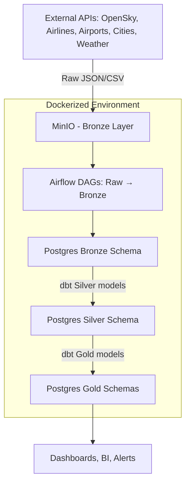

**CAUTION: Work In Progress**

# 🛫 WingWatch: Real-Time Flight Data Pipeline
-blue>)


Aviation. Ingested. Modeled. Analyzed.
**WingWatch** is a **real-time aviation analytics platform** that ingests **OpenSky telemetry, global airports, airlines, cities, and weather feeds** into a modern **data lakehouse pipeline**.

The system follows the **Medallion Architecture** (Bronze → Silver → Gold):
- **Bronze** – raw JSON/CSV from APIs
- **Silver** – cleaned, standardized tables
- **Gold** – analytics/aggregations like approaching flights, emergencies, peak traffic

It’s not mock data. It’s **the sky, transformed for insights** ✨.

***

## 🚀 Project Highlights
- 📡 **Real-time ingestion** of OpenSky and reference datasets
- 🔁 **End-to-end orchestration** with Apache Airflow
- 🏗️ **Medallion lakehouse** with Bronze, Silver, and Gold schemas
- 🧪 **Data Quality checks** (NULL, UNIQUE, DUPLICATE, RANGE) baked in
- 📊 **Analytical Gold models** (traffic by country, emergencies, altitude bands, rare/supersonic aircrafts)
- 🐳 **Docker-first deployment** (Airflow, Postgres, MinIO, Redis, pgAdmin in one stack)

***

## 🛠️ Tech Stack

| Layer              | Technology                        | Role                               |
|--------------------|-----------------------------------|------------------------------------|
| **Orchestration**  | Apache Airflow 2.10.0             | DAG scheduling & monitoring        |
| **Transformations**| dbt-core + dbt-postgres           | SQL-based modeling/business logic  |
| **Storage**        | MinIO (S3 API Compatible)         | Object storage for raw JSON/CSV    |
| **Warehouse**      | PostgreSQL 13                     | Bronze, Silver, Gold schemas       |
| **Deployment**     | Docker Compose                    | Production-ready dev environment   |
| **Data Sources**   | OpenSky, OurAirports, Weather API | Real-world aviation datasets       |

***

## 📊 Data Architecture



***

## 🧱 Medallion Layers

### 1️⃣ **Bronze (Raw → Staging)**
- **DAGs**: `raw_minio_data_ingestion.py`, `bronze_postgres_data_ingestion.py`
- **Data**: Saved in MinIO (JSON) → loaded into Postgres `bronze.*` tables
- **Tables**: `bronze_airlines`, `bronze_airports`, `bronze_cities`, `bronze_flights`

### 2️⃣ **Silver (Refined, Standardized)**
- **DAG**: `silver_postgres_deployment.py`
- **Models**: dbt transforms → cleaned schema & datatypes
- **Tables**: `silver_airports`, `silver_airlines`, `silver_flights`, `silver_cities`

### 3️⃣ **Gold (Analytics & Aggregations)**
- Multiple specialized DAGs:
  - `gold_realtime_flights.py` → approaching flights, phases, emergencies, peak hours
  - `gold_biz_intel.py` → flights by airline, rare aircrafts, airport arrival rate, traffic by country
  - `gold_airspace_analytics.py` → altitude bands, supersonic flights, spatial grid analysis
- **Outputs**: Business & operational insights

***

## 📂 Directory Structure

```
.
├── dags/
│   ├── raw_minio_data_ingestion.py
│   ├── bronze_postgres_data_ingestion.py
│   ├── silver_postgres_deployment.py
│   ├── gold_realtime_flights.py
│   ├── gold_biz_intel.py
│   ├── gold_airspace_analytics.py
│   ├── master_data_pipeline_orchestration.py
│   └── utilities/   # Ingestion, DQ, logging, MinIO ⇄ Postgres
├── dbt/
│   ├── models/
│   │   ├── silver/*.sql
│   │   └── gold/*.sql
│   ├── sources.yml
│   └── profiles.yml
├── sql_scripts/     # Layered DDLs for bronze, silver, gold, admin
├── scripts/         # DB/S3 init scripts
├── docker-compose.yml
├── Dockerfile.airflow
└── requirements.txt
```

***

## ⚙️ Getting Started

### ✅ Prerequisites
- Docker + Docker Compose
- `.env` file with secrets:

```ini
POSTGRES_USER=asad
POSTGRES_PASSWORD=asad
POSTGRES_DB=airflow
MINIO_ROOT_USER=minio_admin
MINIO_ROOT_PASSWORD=minio_password
REDIS_PASSWORD=redis_pass
OPENWEATHER_API_KEY=your_openweather_api
```

### 📦 Installation
```bash
git clone https://github.com/your-org/wingwatch.git
cd wingwatch
docker-compose up -d --build
```

### 🌐 Service Endpoints

| Service      | URL                                | Login                  |
|--------------|------------------------------------|------------------------|
| Airflow UI   | http://localhost:8080              | `airflow / airflow`    |
| MinIO        | http://localhost:9001              | from `.env`            |
| Postgres     | localhost:5432                     | from `.env`            |

***

## 🔍 Sample Insights

- 🛬 How many flights are **approaching airports** right now?
- 🚨 Are there **emergency squawk events**?
- 📈 Which airlines peak at specific **traffic hours**?
- 🛳️ Which regions have **highest net air traffic**?
- ✈️ Which flights are **supersonic or rare aircrafts**?

***

## 🛤 Roadmap

- [ ] Add **real-time Kafka ingestion** alongside batch
- [ ] Build **Superset/Grafana BI dashboards**
- [ ] Enhance **data quality monitoring with alerts**
- [ ] Cloud deployment (Kubernetes + S3 + RDS)

***

## 📜 License
MIT License

***

## 💡 Why This Matters
WingWatch is a **portfolio-grade data platform**, showing how to move **real-world, messy aviation data** through a **production-ready medallion pipeline**:
- Airflow DAG orchestration
- MinIO raw zone ingestion
- Postgres warehouse (Bronze/Silver/Gold)
- dbt transformations & analytics

From **live aircraft telemetry to business insights** — in one modern stack. 🌍✈️
